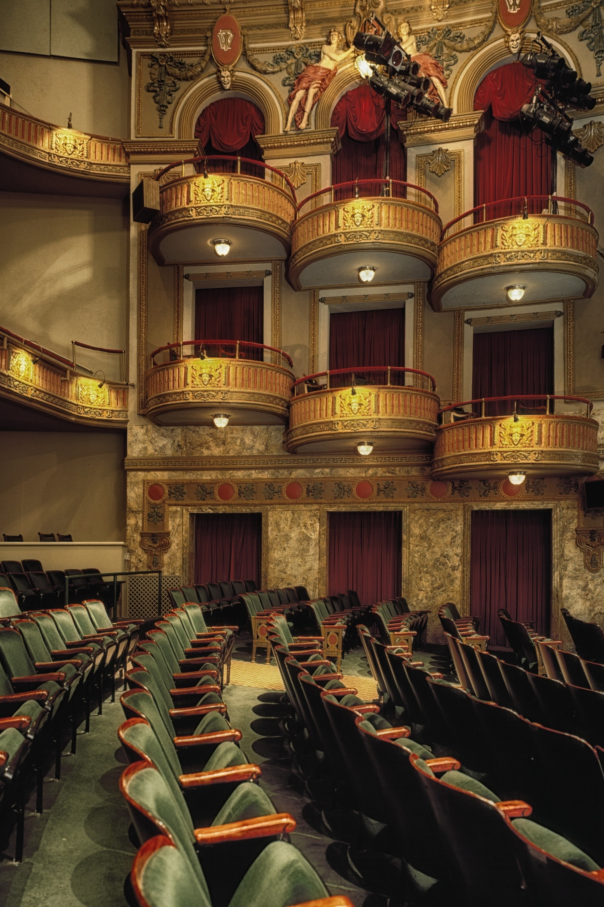

<html>
<head>

<title>6 girls on a stage</title>
<meta name="viewport" content="width=device-width, initial-scale=1">

  

</head>
<body>

  <a href="https://giuliam2.github.io/">Home</a>
  <a href="https://bella2402.github.io">Theater</a>
  <a href="file:///C:/Users/giuli/Desktop/UNIBO/informatica/progetto/1.%20Storia%20Rock.htm">Rock Music</a>
  <a href="#Guitars">Guitars</a>
  <a class="active" href="https://giuliam2.github.io/Reports/">Our Reports</a>

<meta name="viewport" content="width=device-width, initial-scale=1">

<meta name="viewport" content="width=device-width, initial-scale=1">
<link rel="stylesheet" href="https://www.w3schools.com/w3css/4/w3.css">

<body>

  
  
  
<h1 align="left">Our reports</h1>

  

  
  
   

      

      
          

    

  <h1>Theatres in the UK and classical music</h1>
    
This report presents the methodology and tools employed in our project, whose aim was to create a comprehensive analysis of the evolution of rock music beyond gender boundaries, encompassing various time periods and regions. The primary data source for this data-driven project was Wikidata, which provided a wealth of information on artists, genres, and related entities within the rock music domain.  

      <h5>1ST STEP</h5> 
Our initial step involved an exploration of the MusicBo corpus using the Polifonia interrogation tool. We conducted searches for pertinent terms in the music domain, ultimately focusing on the lemmas 'music', 'instruments', 'women', 'rock', and 'influence'. We observed a frequent occurrence of the term 'influence' within the corpus (559 instances), something that prompted us to investigate how one genre could influence and be influenced by others, as well as its broader impact on society. Consequently, our investigation centered on the genre of rock music.
  
<h5>2nd STEP</h5> 
We started collecting relevant data from Wikidata, which served as the basis of the research. We formulated several SPARQL queries to extract information on rock music and its development, its artists, as well as their influence. The collected data were subjected to an in-depth exploration and analysis phase to identify noteworthy correlations and trends. 
To create a compelling story, a narrative structure was developed to organise the collected data into a cohesive structure. The structure aimed to show the development of rock music over the years starting from the 1950s when it was born, continuing with the 10 most influential bands in the USA and highlighting the differences in gender (male and female) of two rock bands. Finally, an exposition of the different sub-genres of rock that developed between the years 1980 and 1985 is shown. Chronological and thematic approaches were used to present the story in an engaging and coherent manner.  
<h5>Tools</h5> 
The main tools employed were the “MusicBo Corpus” and the “SPARQL” query Language, which was utilized to interact with the Wikidata. Data visualization also played a crucial role not only in presenting the findings of the project, but also to foster for us a deeper understanding of the data. The employment of the data visualization tool "MELODY" thus helped us in the creation of tables, charts, graphs, and timelines.
  
<h5>Challenges</h5> 
Ensuring data consistency and completeness proved to be a significant challenge while working with Wikidata. Although Wikidata is a valuable resource, some entities may have in fact limited or incomplete information. Some entities may have less data available, making it difficult to provide a complete analysis or narrative for these specific entities. 
  
<h5>Conclusion</h5> 
Embarking on this project has been an enriching journey, albeit one filled with its fair share of challenges. Familiarizing ourselves with SPARQL queries and Melody required some time, but we are satisfied with the outcome of our data story. Undoubtedly, the use of the data visualization tool MELODY proved invaluable in uncovering insights and creating an engaging story that captures the essence of rock music’s evolution.
 

    
 
      
  

  

   

      

      
      
    

    

  <h1>Theatres in the UK and classical music</h1>
    
INTRO 
This report presents the methodology and tools employed in our project, whose aim was to create a comprehensive analysis of the evolution of rock music beyond gender boundaries, encompassing various time periods and regions. The primary data source for this data-driven project was Wikidata, which provided a wealth of information on artists, genres, and related entities within the rock music domain.  

1ST STEP 
Our initial step involved an exploration of the MusicBo corpus using the Polifonia interrogation tool. We conducted searches for pertinent terms in the music domain, ultimately focusing on the lemmas 'music', 'instruments', 'women', 'rock', and 'influence'. We observed a frequent occurrence of the term 'influence' within the corpus (559 instances), something that prompted us to investigate how one genre could influence and be influenced by others, as well as its broader impact on society. Consequently, our investigation centered on the genre of rock music.
 
2nd STEP 
We started collecting relevant data from Wikidata, which served as the basis of the research. We formulated several SPARQL queries to extract information on rock music and its development, its artists, as well as their influence. The collected data were subjected to an in-depth exploration and analysis phase to identify noteworthy correlations and trends. 
To create a compelling story, a narrative structure was developed to organise the collected data into a cohesive structure. The structure aimed to show the development of rock music over the years starting from the 1950s when it was born, continuing with the 10 most influential bands in the USA and highlighting the differences in gender (male and female) of two rock bands. Finally, an exposition of the different sub-genres of rock that developed between the years 1980 and 1985 is shown. Chronological and thematic approaches were used to present the story in an engaging and coherent manner. 
Tools 
The main tools employed were the “MusicBo Corpus” and the “SPARQL” query Language, which was utilized to interact with the Wikidata. Data visualization also played a crucial role not only in presenting the findings of the project, but also to foster for us a deeper understanding of the data. The employment of the data visualization tool "MELODY" thus helped us in the creation of tables, charts, graphs, and timelines.
 
Challenges 
Ensuring data consistency and completeness proved to be a significant challenge while working with Wikidata. Although Wikidata is a valuable resource, some entities may have in fact limited or incomplete information. Some entities may have less data available, making it difficult to provide a complete analysis or narrative for these specific entities. 
 
Conclusion 
Embarking on this project has been an enriching journey, albeit one filled with its fair share of challenges. Familiarizing ourselves with SPARQL queries and Melody required some time, but we are satisfied with the outcome of our data story. Undoubtedly, the use of the data visualization tool MELODY proved invaluable in uncovering insights and creating an engaging story that captures the essence of rock music’s evolution.
 

    
 
      
  

  
  
   
  

  

<footer>
  
All rights reseved to the 6girls's project.

</footer>

</body>
</html> 
